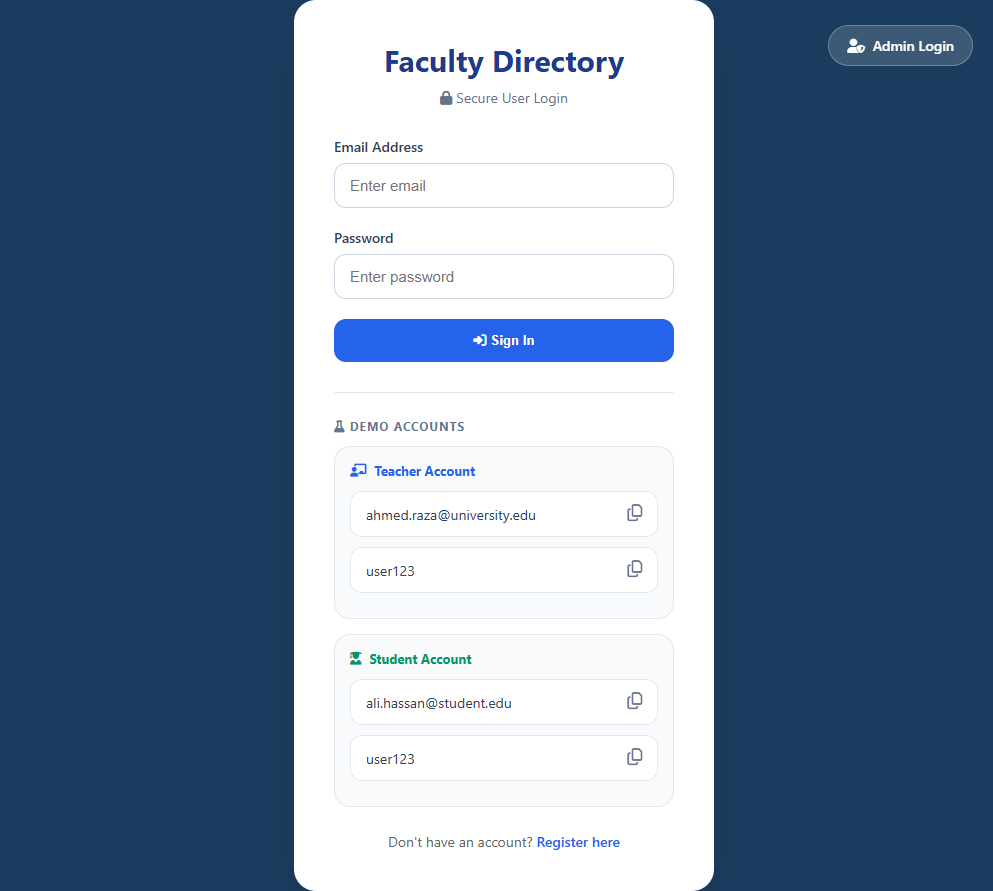
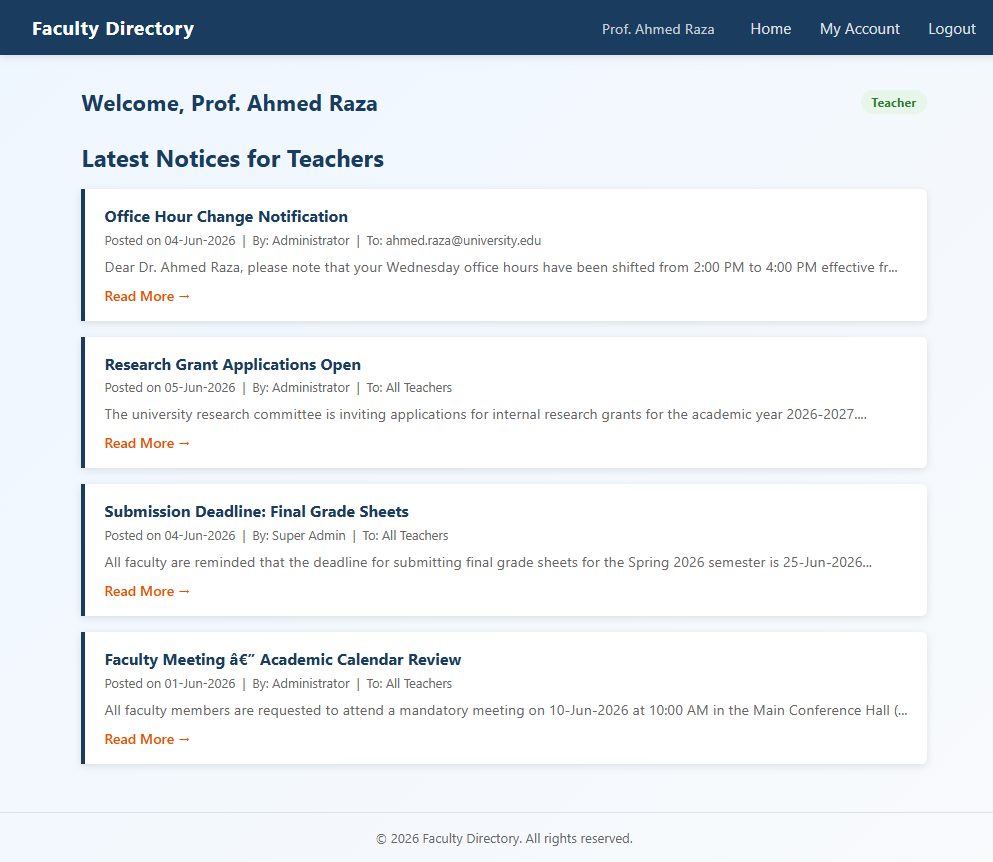
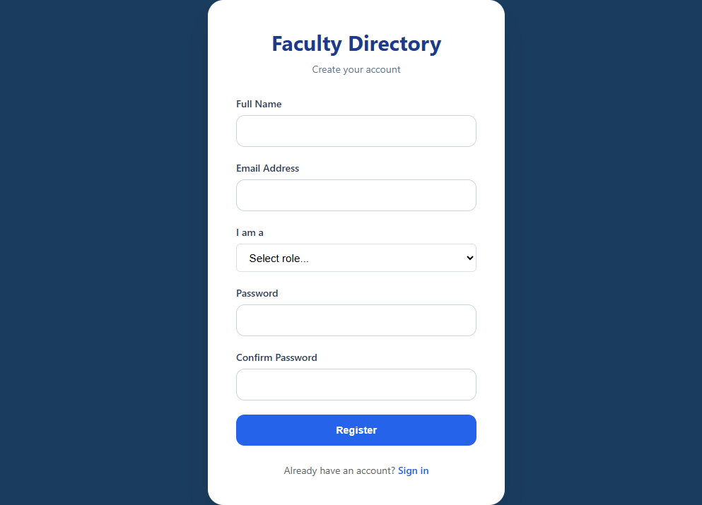
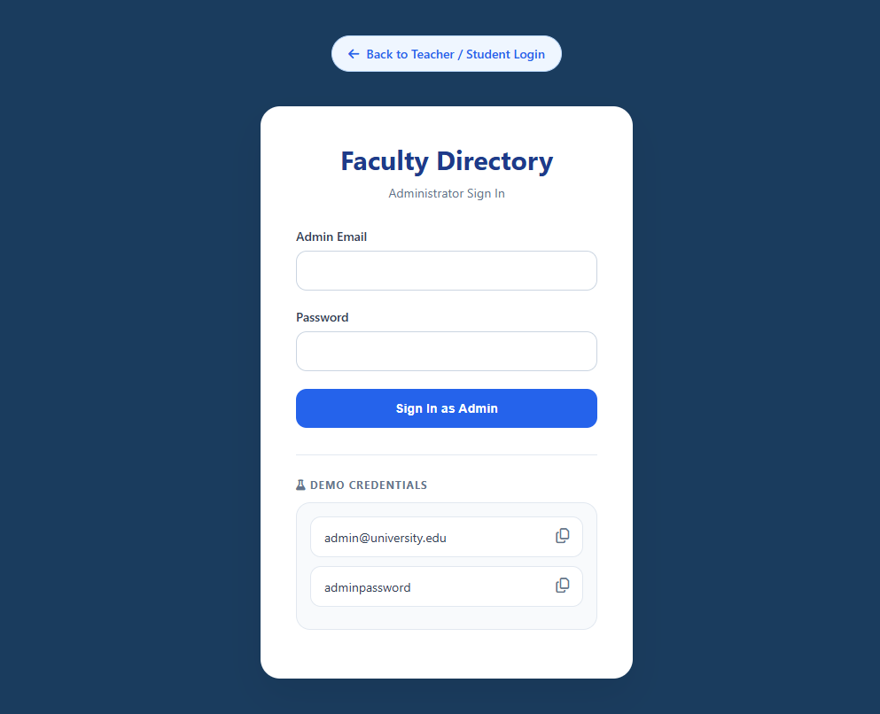
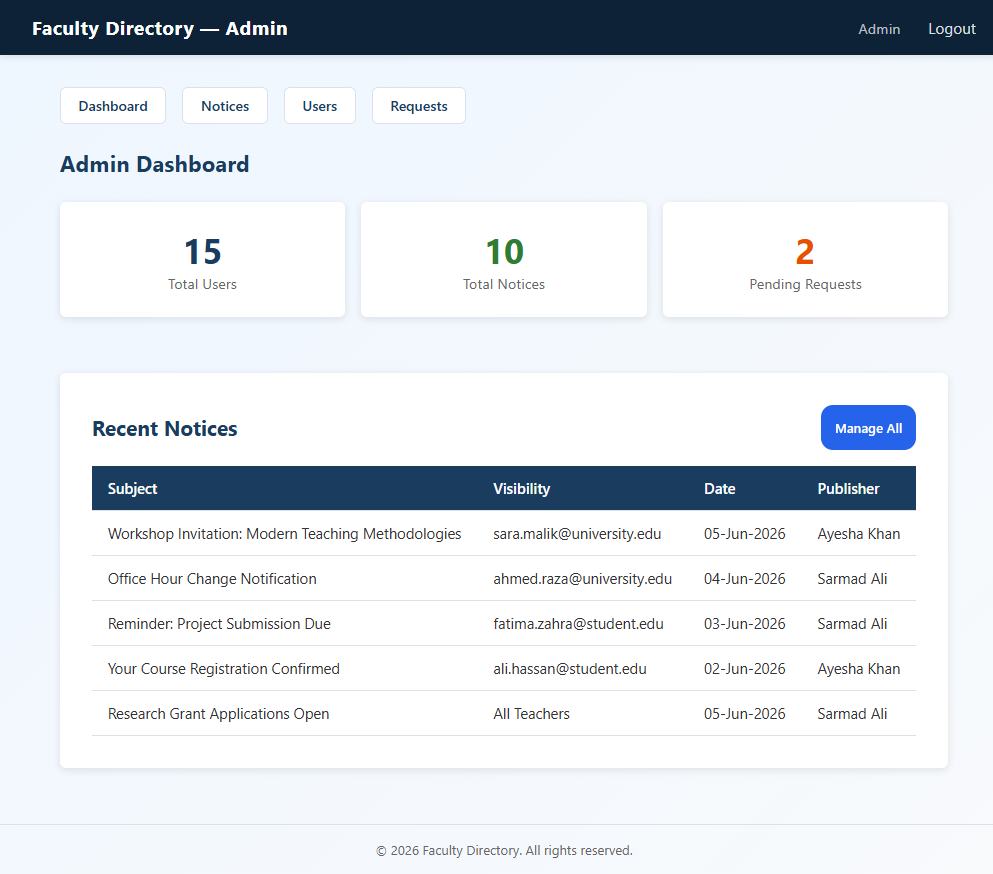
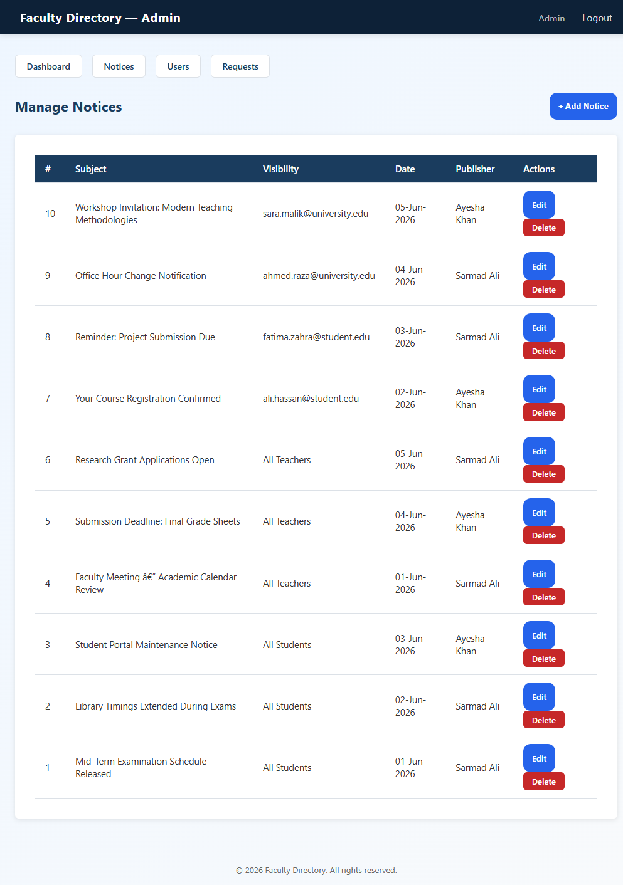
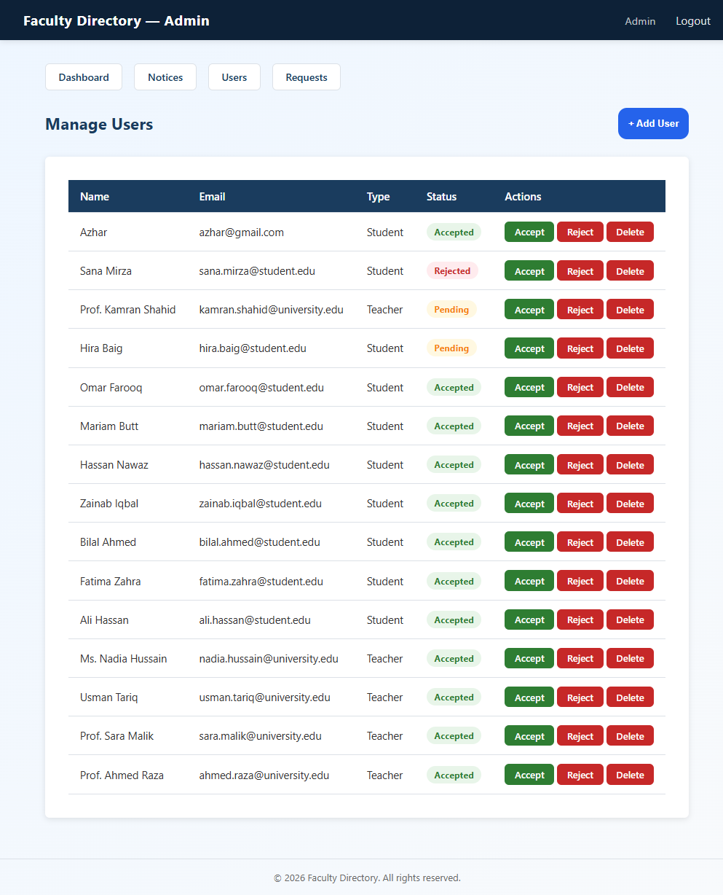

<p align="center">
  <h1 align="center">🎓 Faculty Directory & Notice Board</h1>
  <p align="center">A full-stack university management system built with Core PHP (OOP) and MySQL</p>
  <p align="center">
    
    
    
    
    
  </p>
</p>

---

## 📌 Overview

**Faculty Directory** is a role-based university portal that enables administrators to manage faculty and student registrations and publish targeted institutional notices. Built entirely with **Core PHP (no frameworks)** using clean OOP architecture, it demonstrates real-world web development skills including secure authentication, prepared-statement database access, session management, and a custom-designed responsive UI.

> **Live Demo Note:** Import `database/schema.sql` to get a ready-to-run database with seeded users and sample notices.

---

## ✨ Features

### 🔐 Authentication & Access Control
- Dual-portal system — separate **Admin** and **User** login panels
- Session fixation prevention via `session_regenerate_id(true)` on every login
- Secure cookie settings: `HttpOnly`, `SameSite=Strict`, `use_strict_mode`
- Granular role-based routing: `Auth::requireAdmin()` / `Auth::requireUser()`

### 👥 User Management
- Self-registration with **Pending → Accepted / Rejected** approval workflow
- Admin can add, approve, reject, or delete users directly from the dashboard
- Profile update page: change name, email, or password at any time
- Passwords always stored as **bcrypt hashes** — never plain text

### 📢 Notice Board
- Publish notices to: **All Students**, **All Teachers**, or a **specific user by email**
- Full CRUD: create, edit, delete notices from the admin panel
- Users see only notices addressed to them or their group
- Each notice shows subject, full detail, publisher role, date, and audience

### 🏗️ Architecture & Code Quality
- **Singleton Database class** with a clean prepared-statement API (`select`, `selectOne`, `execute`)
- Five OOP classes: `Database`, `Auth`, `User`, `Notice`, `Admin`
- Single `bootstrap.php` autoloader — one include per page
- All output escaped with `htmlspecialchars()` — XSS-safe throughout
- Admin stats dashboard: live counts of total users, notices, and pending requests

---


## 📸 Screenshots

The following screenshots showcase the major workflows and user interfaces of the application.

---

### 🔐 User Login Portal

Secure login page for **Teachers** and **Students** with role-based authentication, demo account access, and responsive UI design.



---

### 👨‍🏫 User Dashboard

Personalized dashboard displaying notices relevant to the logged-in user (Teacher or Student), including audience filtering and notice details.



---

### 📝 User Registration

Self-registration page with **Pending → Accepted / Rejected** approval workflow managed by the administrator.



---

### 🛡️ Admin Login Portal

Dedicated administrator authentication panel with secure session handling and separate routing from the user portal.



---

### 📊 Admin Dashboard

Administrative overview with live statistics for total users, pending requests, and published notices.



---

### 📢 Notice Management

Create, edit, publish, and delete institutional notices targeted to **All Students**, **All Teachers**, or a **specific user**.



---

### 👥 User Management

Manage faculty and student accounts, including adding users, updating status, and removing accounts.



---

### ✅ Registration Approval Workflow

Approve or reject newly registered users directly from the admin panel.


---


## 🛠️ Tech Stack

| Layer          | Technology                        |
|----------------|-----------------------------------|
| Backend        | PHP 8+ — Core OOP (no framework)  |
| Database       | MySQL 5.7+ / MariaDB 10.4+        |
| Frontend       | HTML5 + CSS3 (custom, no Bootstrap) |
| Authentication | PHP Sessions + bcrypt (`PASSWORD_BCRYPT`) |
| Server         | Apache (XAMPP/WAMP) or PHP built-in |

---

## 📁 Project Structure

```
faculty-directory/
│
├── admin/                          # Admin panel
│   ├── index.php                   # Admin login
│   ├── dashboard.php               # Dashboard & statistics
│   ├── notices.php                 # Notice management (CRUD)
│   ├── users.php                   # User management
│   ├── requests.php                # Registration approval/rejection
│   ├── logout.php                  # Admin logout
│   └── includes/
│       └── header.php              # Admin navigation/header
│
├── assets/
│   ├── css/
│   │   ├── style.css               # Main application stylesheet
│   │   └── contact-widget.css      # Floating contact widget styles
│   │
│   ├── js/
│   │   ├── auth.js                 # Authentication UI interactions
│   │   └── contact-widget.js       # Contact widget functionality
│   │
│   └── screenshots/                # README screenshots
│
├── classes/
│   ├── Admin.php                   # Admin operations
│   ├── Auth.php                    # Authentication & session management
│   ├── Database.php                # Singleton database connection
│   ├── Notice.php                  # Notice management
│   └── User.php                    # User registration & profile management
│
├── config/
│   ├── config.php                  # Database credentials & application constants
│   └── developer.php               # Developer information & portfolio links
│
├── database/
│   └── schema.sql                  # Database schema with demo data
│
├── downloads/
│   └── Fazal-Abbas-Shah-Resume.pdf # Downloadable resume
│
├── includes/
│   ├── bootstrap.php               # Application bootstrap (loads config, classes & session)
│   ├── contact-widget.php          # Floating contact widget
│   ├── header.php                  # Shared user header/navbar
│   └── footer.php                  # Shared footer
│
├── user/
│   ├── account.php                 # Manage profile & password
│   ├── dashboard.php               # User dashboard
│   ├── logout.php                  # User logout
│   ├── notice.php                  # View notice details
│   └── register.php                # User registration
│
├── .gitignore                      # Git ignored files
├── index.php                       # User login / application entry point
├── LICENSE                         # MIT License
└── README.md                       # Project documentation```

---

## 🚀 Getting Started

### Prerequisites
- PHP 8.0 or higher
- MySQL 5.7+ or MariaDB 10.4+
- Apache with `mod_rewrite` (XAMPP / WAMP / Laragon) **or** PHP's built-in server

---

### 1. Clone the Repository
```bash
git clone https://github.com/your-username/faculty-directory-notice-board.git
cd faculty-directory-notice-board
```

### 2. Import the Database
```bash
mysql -u root -p < database/schema.sql
```
This creates the `faculty_directory` database and seeds it with demo admins, users, and notices.

### 3. Configure the Application
Open `config/config.php` and update your local settings:
```php
define('DB_HOST', 'localhost');
define('DB_USER', 'root');       
define('DB_PASS', '');           
define('DB_NAME', 'faculty_directory');

define('APP_URL',  'http://localhost/faculty-directory-notice-board');  // match your server path
```

### 4. Start the Server

**Option A — XAMPP / WAMP:**
Place the project folder inside `htdocs/` (XAMPP) or `www/` (WAMP) and visit:
```
http://localhost/faculty-directory/
```

**Option B — PHP Built-in Server:**
```bash
php -S localhost:8000
```
Then open `http://localhost:8000`

---


## 🌐 Live Demo

Explore the application online using the demo credentials below.

| Portal | URL |
|--------|-----|
| 👤 User Portal | https://facultydirectory.lovestoblog.com |
| 🛡️ Admin Portal | https://facultydirectory.lovestoblog.com/admin |

> **Note:** This is a public demonstration environment. Some data may be reset periodically.


---
## 🔑 Default Login Credentials

### Admin Panel → `/admin/index.php`

| Role           | Email                 | Password |
|----------------|-----------------------|----------|
| Administrator  | admin@gmail.com      | `adminpassword`  | 
| Super Admin    | fazal@gmail.com       | `admin123`  |

### User Portal → `/index.php` (Demo Accounts)

| Type    | Email                          | Password |
|---------|--------------------------------|----------|
| Teacher | ahmed.raza@university.edu      | `user123`|
| Teacher | sara.malik@university.edu      | `user123`|
| Student | ali.hassan@student.edu         | `user123`|
| Student | fatima.zahra@student.edu       | `user123`|

> ⚠️ **Important:** Change all default passwords immediately when deploying to any public or production environment.


---
## 🔒 Security Implementation

| Threat            | Mitigation                                              |
|-------------------|---------------------------------------------------------|
| SQL Injection     | 100% prepared statements via `mysqli_stmt::bind_param` |
| XSS               | All output wrapped in `htmlspecialchars()`             |
| CSRF (sessions)   | `SameSite=Strict` cookies + session regeneration       |
| Session Fixation  | `session_regenerate_id(true)` on every login           |
| Password Storage  | `password_hash($pass, PASSWORD_BCRYPT)` — cost 12      |
| Info Disclosure   | DB errors logged server-side, never shown to users     |
| Unauthorized Access | Route-level guards: `Auth::requireAdmin()` / `requireUser()` |

---

## 📐 OOP Design Highlights

```
Database (Singleton)
└── Single shared connection across the full request lifecycle
└── Public API: select() · selectOne() · execute() · lastInsertId()
└── Private prepare() helper — binding never done outside this class

Auth (Static utility)
└── startSession() — idempotent, called from bootstrap.php
└── loginUser() / loginAdmin() — sets typed session keys
└── requireUser() / requireAdmin() — redirect guards on every protected page

User / Admin / Notice
└── Each class receives Database::getInstance() via constructor
└── No raw SQL outside these classes — all queries centralized
```

---

## 🗄️ Database Schema

```sql
admin          — id, username, email, password (bcrypt), role
registration   — u_id, u_name, u_email, u_password (bcrypt),
                 u_type (Student|Teacher), status (Pending|Accepted|Rejected)
notices        — ID, subject, detail, date, user (publisher name),
                 category (audience), role (publisher role)
```

---

## 🧪 Sample Data Included

The `schema.sql` ships with realistic seeded data:
- **2 admin accounts** (Administrator + Super Admin)
- **14 registered users** (4 teachers, 8 accepted students, 1 pending, 1 rejected)
- **10 sample notices** targeting various audiences (All Students, All Teachers, specific emails)

This lets you explore every feature of the system immediately after import — no manual data entry required.

---


## 👤 Author

**Fazal Abbas Shah**  
[GitHub](https://github.com/Fazal5172/faculty-directory-notice-board) ·
[LinkedIn](https://www.linkedin.com/in/fazal111/)

---

## 📄 License

This project is licensed under the [MIT License](LICENSE) — free to use, modify, and distribute.

---

<p align="center">Built with Core PHP (OOP), MySQL, and modern PHP security practices.</p>
